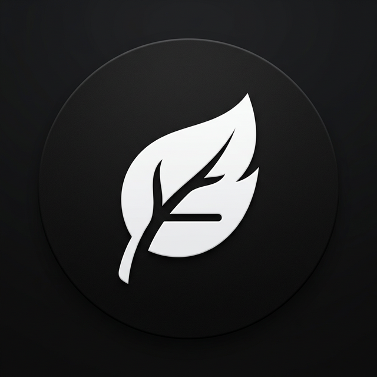
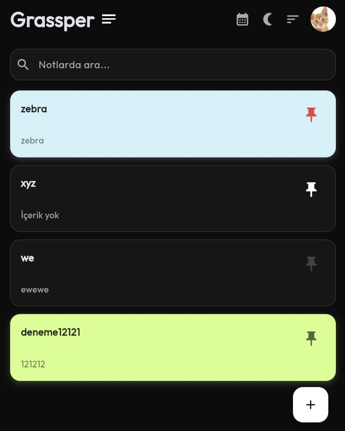

<p align="center">
  
</p>

<h1 align="center">Grassper</h1>

<p align="center">
  <strong>Ultra Minimalist, Hız Odaklı ve Güvenli Not Alma Deneyimi</strong><br>
  <em>"Çünkü düşünceler beklemeye gelmez."</em>
</p>

<p align="center">
  
  
  
  
</p>

---

## ✨ Grassper Nedir?

**Grassper**, hız ve gizlilik odaklı, "Sıfır Buton" felsefesini benimseyen modern bir not alma çözümüdür. Material 3 tasarım dilinin sadeliğini, güçlü bir yerel veritabanı (Hive) ve kullanıcı dostu özelliklerle birleştirir.

## 🚀 Tüm Özellikler (Full Feature List)

### 📝 Editör ve Metin Yönetimi
- **Sıfır Buton Politikası (Tam Otomatik Kayıt):** Yazdığınız veya çizdiğiniz her şey, siz yazarken anlık olarak kaydedilir. Kaydetme stresi bitti.
- **Karakter ve Kelime Sayacı:** Yazma alanında gerçek zamanlı istatistik takibi.
- **Odak Modu:** Sade, dikkatinizi dağıtmayan tam ekran yazma alanı.
- **Boş Not Temizliği:** İçeriği olmayan veya boş bırakılan notlar sistem tarafından otomatik temizlenir, kalabalık yapmaz.

### 🎨 Görsel ve Çizim Yetenekleri
- **Pro Sketch (Çizim) Modu:** Basınca duyarlı fırçalar, geniş renk paleti ve pürüzsüz çizim deneyimi.
- **Şipşak Kamera:** Editörden çıkmadan anında fotoğraf çekin ve notunuza görsel ekleyin.
- **Özel Kart Renkleri:** Notlarınıza 8 farklı canlı renk arasından seçim yaparak kişilik kazandırın.
- **Görsel Önizleme:** Ana ekranda çizimlerinizi veya fotoğraflarınızı net bir şekilde görün.

### 🍱 Organizasyon ve Görünüm
- **Akıllı Sabitleme (Pin):** Notlarınızı en üste sabitleyin. Önemli notları kırmızı pin ile işaretleyerek vurgulayın.
- **Esnek Sıralama:** Yeniden eskiye, eskiden yeniye veya A'dan Z'ye alfabetik sıralama seçenekleri.
- **Dinamik Yerleşim:** Tek tıkla **Liste (List)** veya **Izgara (Grid)** görünümü arasında geçiş yapın.
- **Güçlü Arama:** Başlık veya içerik üzerinden milisaniyeler içinde arama yapın.

### 🖐️ Erişilebilirlik ve Kişiselleştirme
- **Solak Modu:** Uygulama arayüzünü (ikonlar, butonlar) sol el kullanımına göre tek tıkla aynalayın.
- **Profil Yönetimi:** Yerel profil fotoğrafı ekleyin, kendi dünyanızı kurun.
- **Tam Kapsamlı Dil Desteği:** Türkçe ve İngilizce dilleri arasında akıcı geçiş.
- **Takvim Ayarları:** Hafta başlangıç gününü (Pazartesi / Pazar) dilediğiniz gibi seçin.

### 🏁 Hızlı İş Akışı
- **Ultra Minimalizm:** "Başlıksız Not" veya "İçerik Yok" gibi görsel gürültüleri kaldırdık.
- **Çoklu Seçim (Multi-Select):** Notları topluca seçin, hızlıca arşivleyin veya silin.
- **Onay Diyaloğu Olmayan Silme:** Çöp kutusuna taşıma işlemleri onay sormadan anında gerçekleşir (Yine de çöp kutusunda güvenle bekler).
- **Akıllı Navigasyon:** Arşiv ve Çöp Kutusu'na profil ayarlarından hızlı erişim.

### 🔒 Güvenlik ve Veri Özgürlüğü
- **%100 Offline (Yerel):** Verileriniz asla cihazınızdan çıkmaz. Bulut yedeği zorunluluğu yoktur.
- **Esnek Yedekleme:** Notlarınızı JSON formatında dışa aktarın veya farklı bir Grassper yüklü cihaza aktarın.
- **Email Yedekleme:** Tek tıkla tüm arşivi kendi e-posta adresinize şifreli veya düz metin yedeği olarak gönderin.
- **Günlük Otomatik Yedekleme Hatırlatıcısı:** Verilerinizi en son ne zaman yedeklediğinizi takip edin.

## 🛠 Teknik Altyapı
- **Framework:** Flutter (Material 3)
- **Database:** Hive (NoSQL / Binary Storage)
- **Font:** Outfit (Google Fonts)
- **Architecture:** Provider (State Management)

## 📸 Ekran Görüntüleri

<p align="center">
  
</p>

```bash
flutter pub get
dart run build_runner build --delete-conflicting-outputs
flutter run
```

---
<p align="center">
  @sentifoss\faruk-guler tarafından ❤️ ile yapıldı.<br>
  <a href="https://github.com/faruk-guler">github.com/faruk-guler</a>
</p>
